# Code execution instruction:
Ниже дана ссылка на блокнот. Его содержание не сильно отличется от предложенного в задании, только лишь добалены некоторые функции для удобства генерации нескольких изображений. Для повторного запуска нужно убедиться, что все пути в программах правельные, а также изменить один из файлов после его загрузки (подробнее см. в самом ноутбуке).

Link: . Из-за проблем с отображением картинок все изображения также можно найти и [тут](https://drive.google.com/drive/folders/1SHbCtjw5mofptmjcA8T7MsJy9Ko-O4AF?usp=sharing). 

# Изучение статьи.

## Тематика и её проблемы.
* ***Что это такое?***

    Генерация визуального контента диффузионными моделями - это процесс создания изображения с использованием диффузионных моделей, которые являются одним из типов генеративных вероятностных моделей. Их работа основана на прямой и обратной диффузии, где сначала к изображению (или его представлению в латентном пространстве) добавляется шум, а потом из этого шума модель итеративно пытается восстановить исходное изображение. Более подробно смотри, например, эту статью: [Ho, Jonathan, et al. Denoising Diffusion Probabilistic Models, 16 Dec. 2020](https://arxiv.org/abs/2006.11239).

    Дальнейшее обучение (fine tuning) диффузионных моделей для новой предметной области означает использование ранее существовавшей диффузионной модели, которая уже была обучена на одном типе данных или предметной области, и адаптацию ее для создания контента в другой предметной области. Эта адаптация включает в себя дообучение модели с использованием данных из новой предметной области, чтобы она могла генерировать изображения или контент, соответствующие характеристикам и шаблонам новой предметной области. Этот процесс помогает модели стать более универсальной и способной генерировать разнообразный контент за пределами ее первоначальной предметной области, для которой она обучалась.

* ***Почему над этим работают?***

    Применений у данной области довольно много, некоторые из них будут подробнее описаны ниже в разборе статьи, но если в общем, то:
    * **Генерация контента**: Эти модели позволяют автоматически создавать визуальный контент, такой как изображения, художественные работы и дизайны, которые могут найти применение в различных областях творчества. Они могут помочь художникам, дизайнерам и создателям контента, предоставляя инструмент для создания новых и разнообразных визуальных материалов. Также, например, в медицинской области эти модели могут быть точно настроены для создания реалистичных изображений конкретных заболеваний для обучения медицинских работников.
  
    * **Увеличение объема данных (data augmentation)**: Адаптация моделей распространения к новым областям посредством обучения позволяет увеличить объем данных. Увеличение объема данных включает в себя создание вариаций существующих данных путем применения таких преобразований, как повороты, переводы и модификации. Это может быть полезно для обучения моделей машинного обучения в областях, где данных мало или их получение очень дорого.

    * **Развлечения и медиа**: Эти модели могут использоваться в индустрии развлечений и медиа-индустрии для создания спецэффектов, виртуальной среды и других визуальных элементов для фильмов, видеоигр и виртуальной реальности.

    * **Персонализация**: Адаптация моделей к новым доменам может привести к созданию персонализированного контента. Например, в сфере моды этих моделей можно обучить создавать уникальные дизайны одежды, основанные на индивидуальных предпочтениях.
* ***Как формулируется задача?***

    Задачу можно сформулируеть следующим образом: по входному текстовому описанию требуется сгенерировать наиболее релевантное к нему и деталезированное изображение с помощью text-to-image диффузионных моделей.

## Обзор статьи и решения.

* ***В чем ее основная идея?***

    Большие text-to-image модели позволяют генерировать разнообразные высококачественные изображения по текстовому описанию. Однако им не удается формировать изображения одного и того же объекта, но уже в различных сценических обстоятельствах. Авторы статьи предлагают технику дообучения уже предобученной text-to-image диффузионные модели на собственной функции ошибок с сохранением первоначальных семантических знаний. Причём достаточно батча картинок с объектом в размере 3-5 штук при обучении для генерации этого же объекта, но уже в произвольных, заданных пользователем условиях. Это достигается путем привязки уникального идентификатора к объекту в процессе обучения на собсвенно сконструированной loss-функции. Важно отметить, что в качестве таких идентификаторов использовались декодированные самые редкие токены (токены с наименьшими априорними знаниями) из всего словаря модели (достаточно 1-3 символа полученного при декодировке текста), чтобы при привзке нового объекта, не портить априорные знания модели о других словах.

* ***В чем ее новаторство?***

    Раньше не было оптимального способа для "вставки" данного объекта в словарь модели (few-shot training). Лучшим на тот момент было использование GAN'ов, но в задаче воспроизведения лиц (Kerras Tero, Samuli Laine and Timo Alia, [A Style-Based Generator Architecture for Generative Adversarial Networks](https://arxiv.org/abs/1812.04948), 2019), причём для обучения требовалось около 100 изображений исходного объекта, что совсем не подходило для данной задачи.

    Согласно статье, предложенная авторами методика позволяет синтезировать данный объект в различных сценах, позах, ракурсах и условиях освещения, которые не были в обучающей выборке, с сохранением основных свойств объекта. Также это позволило использовать данное решение в прежде неподступных задачах. Предлагаемое решение в задаче:
    * **Recontextualization**: дало возможность по описанию генерировать объект в разных сценических контекстах, даже тех, что модель раньше не видела и без использования 3D рендеринга сцены.
    * **Art Renditions**: позволило создавать художественные интерпретации данного предмета, перенося на объект не только стилистику, но и получая его вариации, сохранив при этом ключивые особенности данного объекта.
    * **Novel View Synthesis**: позволило получать изображения данного объекта с новых ракурсов.
    * **Property Modification**: дало генерацию новых свойств объекта.
    * **Accessorization**: позволило добавлять различные аксессуары к исходному объекту.

    Также авторы предлагают способ оценки качества получаемого результата и новый датасет для этих задач.
  
* ***Какие получились результаты?***

    Авторы собрали 25 промтов и датасет из 30 объектов и разделили их на группы живое не живое. После было сгенерировано 4 изображения для каждого объекта и промта; в итоге получилось 3000 изображений. Для измерения предметной точности сгенерированных объектов авторы использовали CLIP-I и DINO метрики. Первая сравнивает среднюю косинусную близость эмбеддингов реальной и сгенерированной картинки, полученных с помощью CLIP'а, вторая, предложенная авторами вследствии недостаточности первой, -  также сравнивает среднюю косинусную близость, но уже между эмбеддингами полученными с помошью ViTS/16 DINO. По мнению авторов это лучшая метрика для данной задачи, поскольку трансформер обучался различать не только объекты в общем, но и внутри одного класса. Метрику, обозначенную авторами, как CLIP-T, использовали для сравнения промта и картинки, точно также получая их эмбеддинги с помощью CLIP'а.

    Результаты сравнивались с единственной известной и релевантной на тот момент работой (Gal et al, [An image is worth one word: Personalizing text-toimage generation using textual inversion.](https://arxiv.org/abs/2208.01618)). Авторы генерировали кртинки с помощью Stable Diffusion и Imagen. Последний метод дал наилучший результат по всем используемым метрикаам: DINO - $0.696$, CLIP-I - $0.812$, CLIP-T - $0.306$ (подробнее см. в самой [статье](https://arxiv.org/pdf/2208.12242.pdf) таб. 2). Также проводился опрос по сравнию картинок с реальным и со сгенерированным объектом. И он показал подавляющее превосходство предложенного авторами метода по сравнению с Textual Inversion. 

# Практическая часть: дообучение весов модели LoRA под новый домен.

При запуске [предлагаемого](https://colab.research.google.com/drive/1iSFDpRBKEWr2HLlz243rbym3J2X95kcy?usp=sharing) ноутбука были ошибки: [link1](https://github.com/cloneofsimo/lora/pull/256), [link2](https://github.com/huggingface/accelerate/issues/1550?ysclid=llvzm7qt8g15639166)

В качестве "домена" будем использовать эскизы одного персонажа из игры Disco Elysium - Kim Kitsuragi. Ниже приведены 5 его изображений, использованных для дообучения.

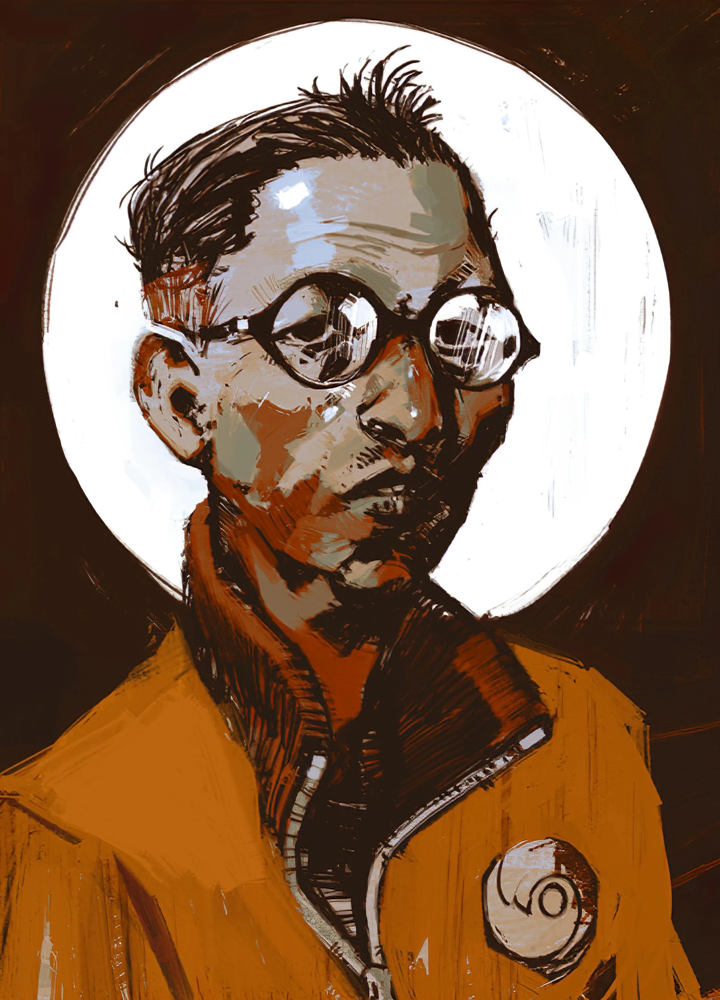 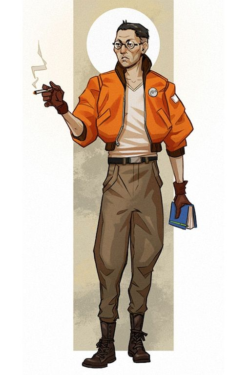 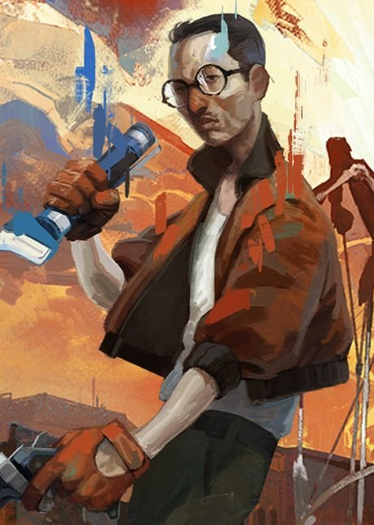 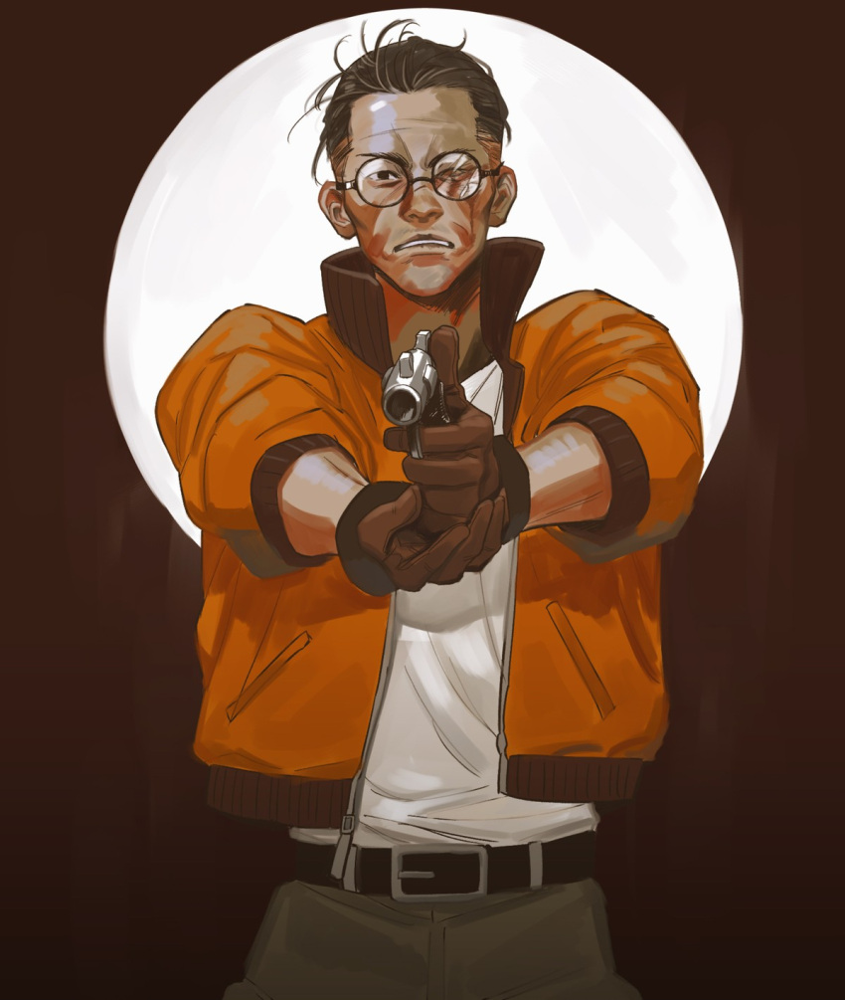
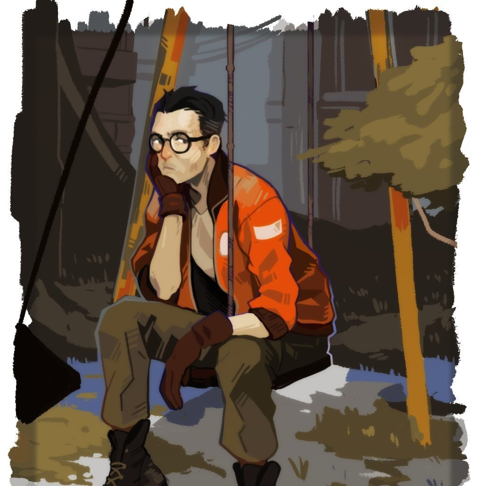

Для дообучения использовалась модель Stable Diffusion v1.5 на $5$ фотографиях. В качестве количества шагов (для первых $3$х экспериментов; гиперпараметр `max_train_steps`) было выбрано значение $1000$ (в целях экономии ресурсов и времени), а `batch_size` $= 1$, `lora_rank` $= 16$ и в процессе дальнейших экспериментов не изменялись. Ниже будут приведены наиболее удачные и осмысленные изображения для различных значений гиперпараметров `learning_rate` и `learning_rate_text` при обучении и `LORA_SCALE_UNET`, `LORA_SCALE_TEXT_ENCODER`, `GUIDANCE` при инференсе. Все же остальные картинки можно найти в соответсвующих папках; каждая папка имеет название "$a;b$", где $a$ - это `learning_rate`, $b$ - `learning_rate_text`, сами же изображения имеют название "$pr\_a;b;c$", где $pr$ - это сокращение используемого промта, $a$, $b$, $c$ - это гиперпараметры `LORA_SCALE_UNET`, `LORA_SCALE_TEXT_ENCODER`, `GUIDANCE` модели при инференсе соответсвенно. Сами изображения генерировались на основе шести описаний: *`smile face`*, *`falling from the cliff`*, *`sitting in the pub`* и для сравнения насколько хорошо модель выучила объект: *`A ktn is smiling`*, *`A ktn is falling from the cliff`*, *`A ktn is sitting in the pub`*, где *`ktn`* - идентификатор объекта, заданный при обучении.

P.S. для воспроизведения: `--seed=123`

1. `learning_rate` = $3e-4$, `learning_rate_text` = $1e-5$:
   * Promt: *smile face*:

        Image | 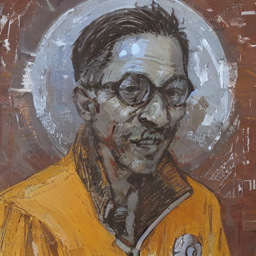 | 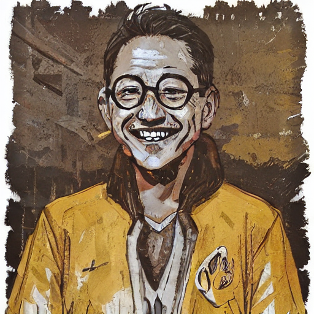 | 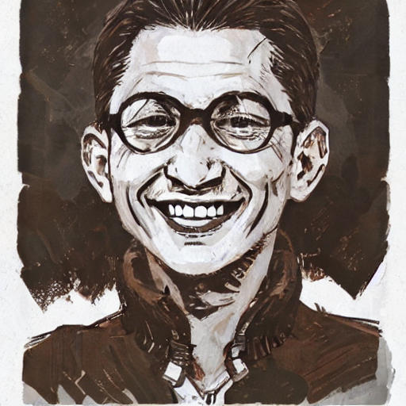 |
        :---: | :---: | :---: | :---:
        GUIDANCE | 1 | 3,6 | 4 |
        LORA_SCALE_UNET | 0,9 | 0,9 | 0,9 |
        LORA_SCALE_TEXT_ENCODER | 0,5 | 0,6 | 0,5 |

        Image | 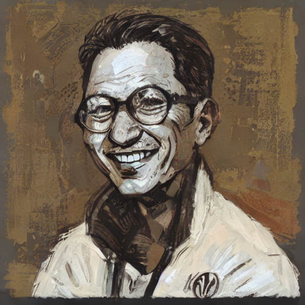 | 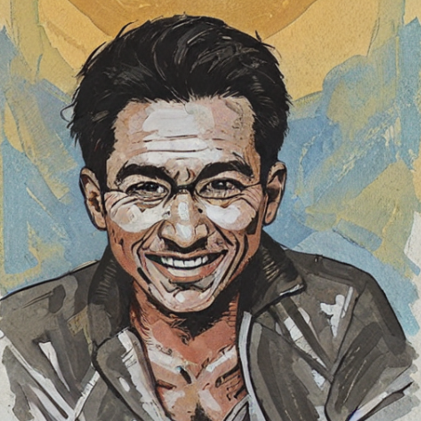 | 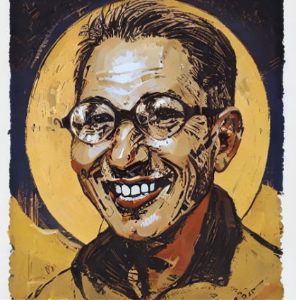 |
        :---: | :---: | :---: | :---:
        GUIDANCE | 3 | 2 | 3,4 |
        LORA_SCALE_UNET | 0,9 | 0,7 | 0,9 |
        LORA_SCALE_TEXT_ENCODER | 0,2 | 0,3 | 0,6 |

        Из визуального сравнения изображений видно, что наиболее удачными / правильными получились при гиперпараметрах: `GUIDANCE` около $3$; `LORA_SCALE_UNET` примерно $0.9$; `LORA_SCALE_TEXT_ENCODER` от $0.5$ до $0.6$. Причем также стоит отметить, что сильно большие/маленькие значения всех параметров или по одиночке давали результат практически не соответсвующий задаче. Сам же стиль изображений совпадал при любых (не экстримальных) значениях гиперпараметров.

        Посмотрим насколько изментися результат, если в промте мы конкретно укажем на объект индефикатором (`--instance_prompt` $=$ ktn), используя промт *A ktn is smiling*.

        Image | 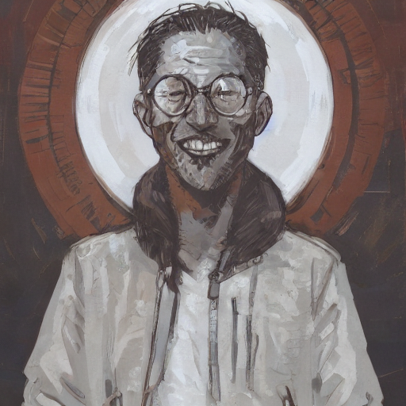 | 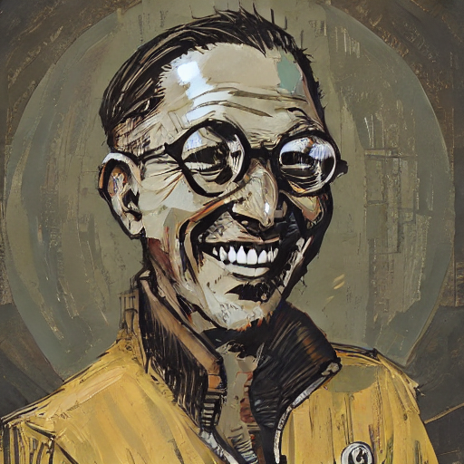 | 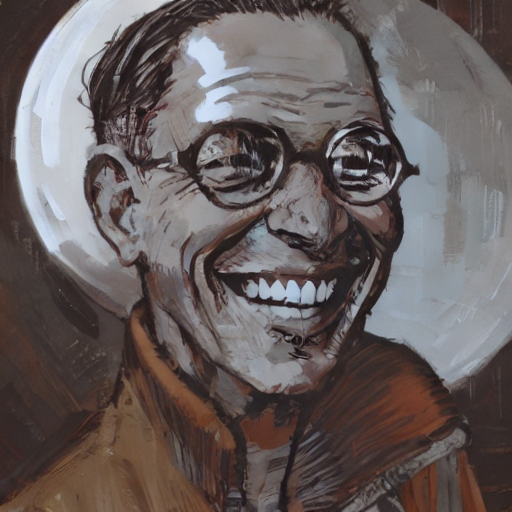 |
        :---: | :---: | :---: | :---:
        GUIDANCE | 1 | 3,6 | 4 |
        LORA_SCALE_UNET | 0,9 | 0,9 | 0,9 |
        LORA_SCALE_TEXT_ENCODER | 0,5 | 0,6 | 0,5 |

        Image | 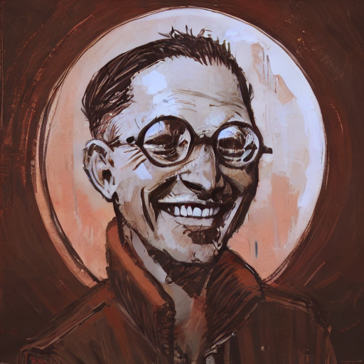 | 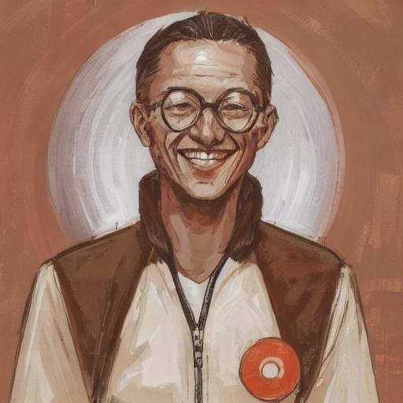 | 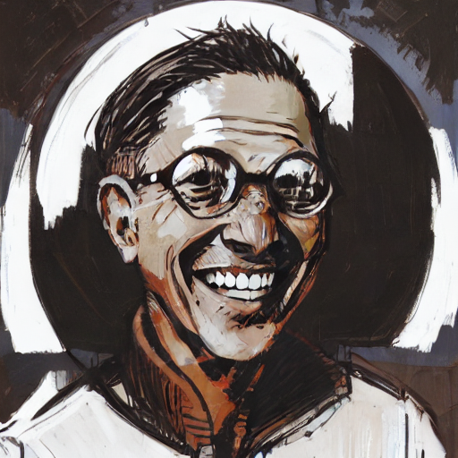 |
        :---: | :---: | :---: | :---:
        GUIDANCE | 3 | 2 | 3,4 |
        LORA_SCALE_UNET | 0,9 | 0,7 | 0,9 |
        LORA_SCALE_TEXT_ENCODER | 0,2 | 0,3 | 0,6 |

        Лицо стало более схожим с оригиналм даже при сильно разных значениях ltarning rates.

    * Promt: *falling from the cliff*:

        К сожалению, при данном запросе, получить каких-то осмысленных/правильных изображений не получилось, кикие бы гиперпараметры не использовались (скорее всего нужно дольше обучать модель), поэтому ниже приведу наиболее удачные из всех возможных (все остальные генерации можно посмотреть в соответсвующей папке):

        Image | 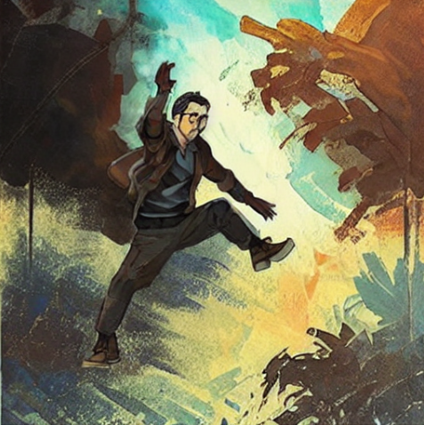 | 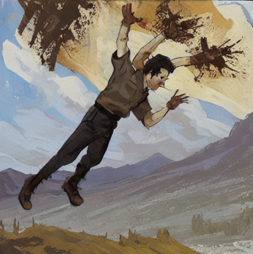 | 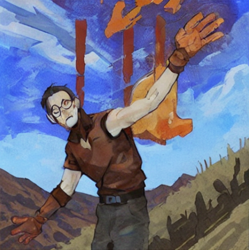 |
        :---: | :---: | :---: | :---:
        GUIDANCE | 3,2 | 3 | 3,6 |
        LORA_SCALE_UNET | 1 | 0,9 | 1 |
        LORA_SCALE_TEXT_ENCODER | 1 | 0,6 | 1 |

        Ради справедливости стоит отметить, что при разумных знчениях гиперпараметров прослеживается соответсвие описанию, и стиль всех изображений тоже сходится с оригиналами. Наиболее удачными гиперпараметрами получились те, что как раз показаны в таблице выше.

        Посмотрим насколько изментися результат, если в промте мы конкретно укажем на объект индефикатором (`--instance_prompt` $=$ ktn), используя промт *A ktn is falling from the cliff*.

        Image | 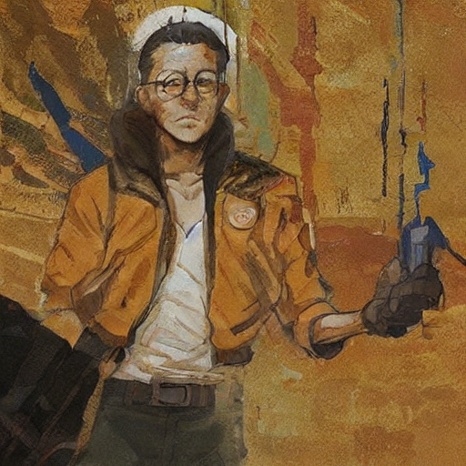 | 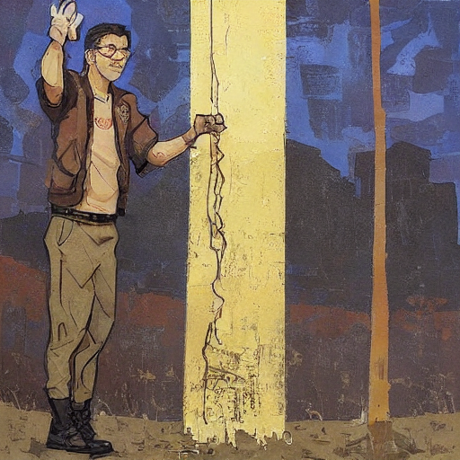 | 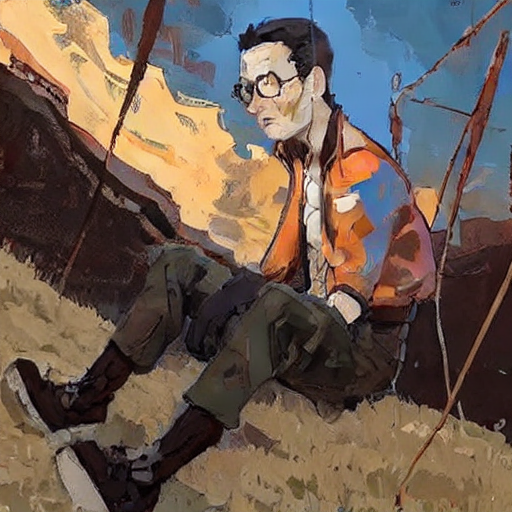 |
        :---: | :---: | :---: | :---:
        GUIDANCE | 3,2 | 3 | 3,6 |
        LORA_SCALE_UNET | 1 | 0,9 | 1 |
        LORA_SCALE_TEXT_ENCODER | 1 | 0,6 | 1 |

        Тут выдно, что чёткое указание на данный объект помогает модели его воспроизводить, хотя точность по описанию не совсем точна.

    * Promt: *sitting in the pub*:

        Аналогично получилось и тут, поэтому покажу только самые удачные:

        Image | 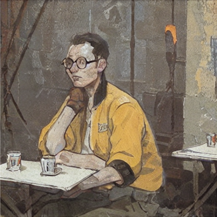 | 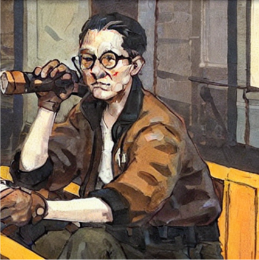 | 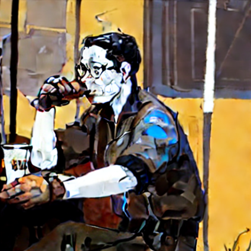 |
        :---: | :---: | :---: | :---:
        GUIDANCE | 3 | 5 | 9 |
        LORA_SCALE_UNET | 1 | 1 | 1 |
        LORA_SCALE_TEXT_ENCODER | 1 | 1 | 1 |

        Посмотрим насколько изментися результат, если в промте мы конкретно укажем на объект индефикатором (`--instance_prompt` $=$ ktn), используя промт *A ktn is sitting in the pub*.

        Image | 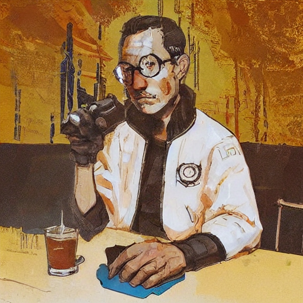 | 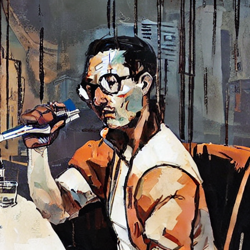 | 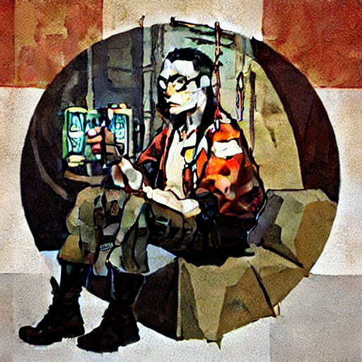 |
        :---: | :---: | :---: | :---:
        GUIDANCE | 3 | 5 | 9 |
        LORA_SCALE_UNET | 1 | 1 | 1 |
        LORA_SCALE_TEXT_ENCODER | 1 | 1 | 1 |

2. Для более точной настройки попробуем уменьшить `learning_rate` до $1e-4$, сохранив при этом `learning_rate_text` как и был $1e-5$, а также изменим `lr_scheduler` на linear вместо constant, который был в предыдущем примере:
   * Promt: *smile face*:

        Результаты для сравнения:

        Image | 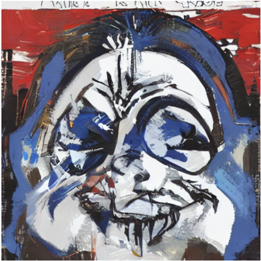 | 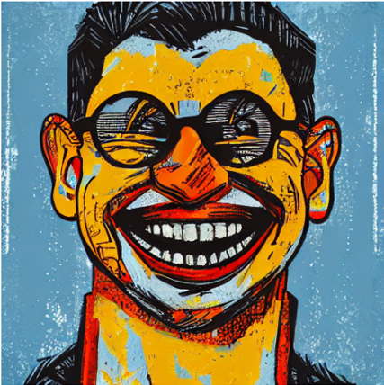 | 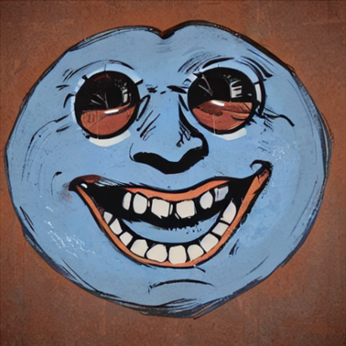 |
        :---: | :---: | :---: | :---:
        GUIDANCE | 1 | 3,6 | 4 |
        LORA_SCALE_UNET | 0,9 | 0,9 | 0,9 |
        LORA_SCALE_TEXT_ENCODER | 0,5 | 0,6 | 0,5 |

        Image | 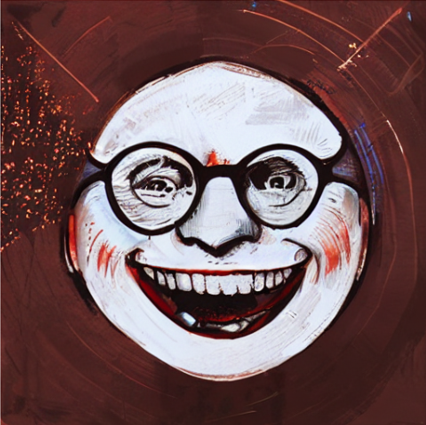 | 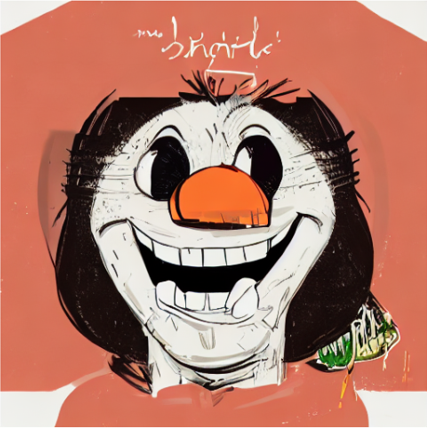 | 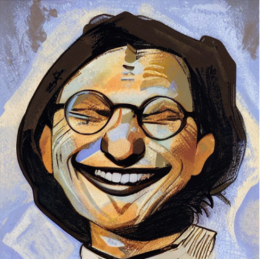 |
        :---: | :---: | :---: | :---:
        GUIDANCE | 3 | 2 | 3,4 |
        LORA_SCALE_UNET | 0,9 | 0,7 | 0,9 |
        LORA_SCALE_TEXT_ENCODER | 0,2 | 0,3 | 0,6 |

        Тут в отличие от предыдущей настройки, видимо не хватило шагов для более точного обучения (то есть параметры learning rate были слишком малы). Модель при данном запросе более буквально восприняла задачу, и практически не воспроизводила стиль и мимику оригинала, хотя какие-то основные признаки, например, круглые очки присутсвовали на большинстве изображений.

        Для промта *A ktn is smiling*.

        Image | 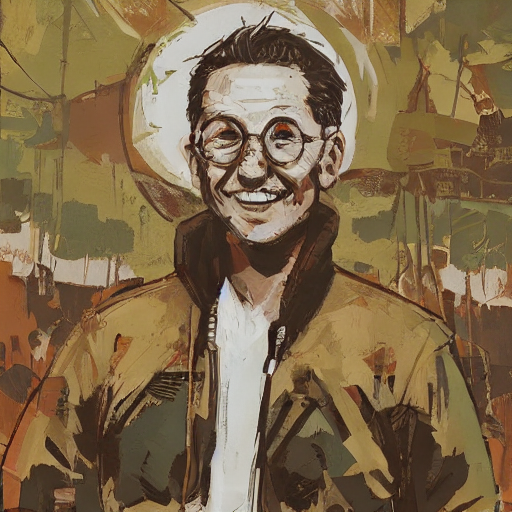 | 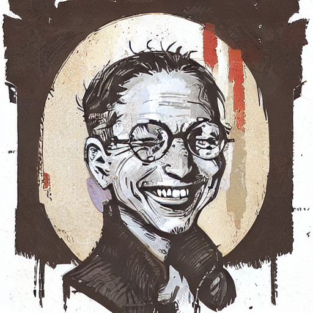 | 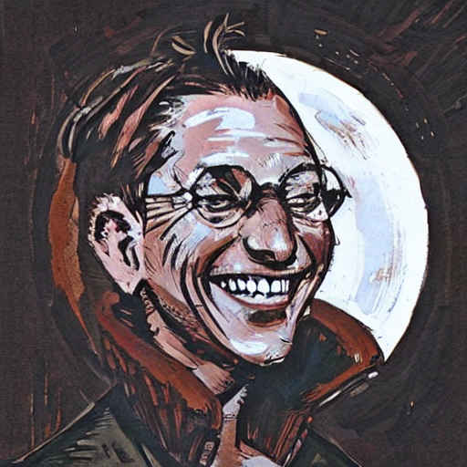 |
        :---: | :---: | :---: | :---:
        GUIDANCE | 1 | 3,6 | 4 |
        LORA_SCALE_UNET | 0,9 | 0,9 | 0,9 |
        LORA_SCALE_TEXT_ENCODER | 0,5 | 0,6 | 0,5 |

        Image | 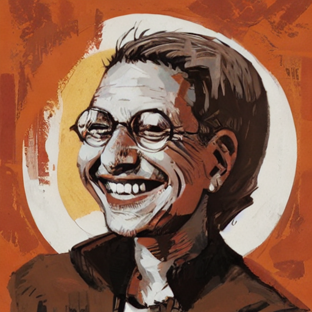 | 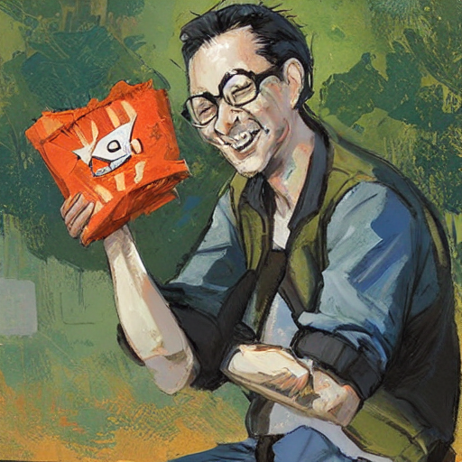 | 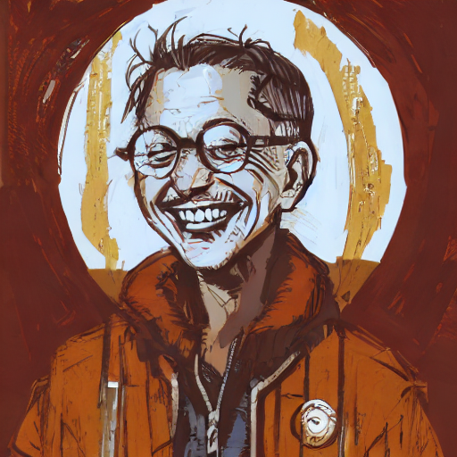 |
        :---: | :---: | :---: | :---:
        GUIDANCE | 3 | 2 | 3,4 |
        LORA_SCALE_UNET | 0,9 | 0,7 | 0,9 |
        LORA_SCALE_TEXT_ENCODER | 0,2 | 0,3 | 0,6 |

        Результат намного лучше (даже анатомия рук на удивление правильная).

   * Promt: *falling from the cliff*:

        Результаты для сравнения:

        Image | 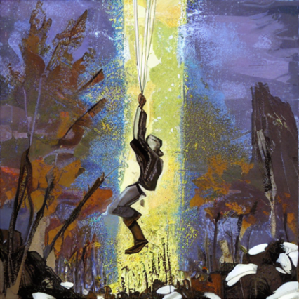 | 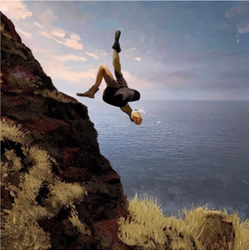 | 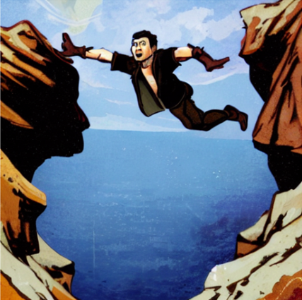 |
        :---: | :---: | :---: | :---:
        GUIDANCE | 3,2 | 3 | 3,6 |
        LORA_SCALE_UNET | 1 | 0,9 | 1 |
        LORA_SCALE_TEXT_ENCODER | 1 | 0,6 | 1 |

        Видно, что тут результат еще хуже получился так как практически отсутвует основная стилистика оригинала и анатомия также неправильная.

        Наиболее удачными были следующие гиперпараметры инференса при данной настройке: 
        
        Image | 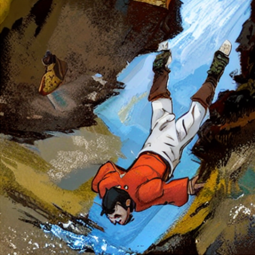 | 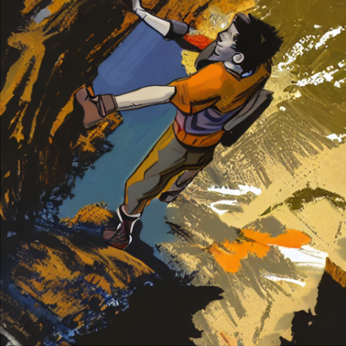 | 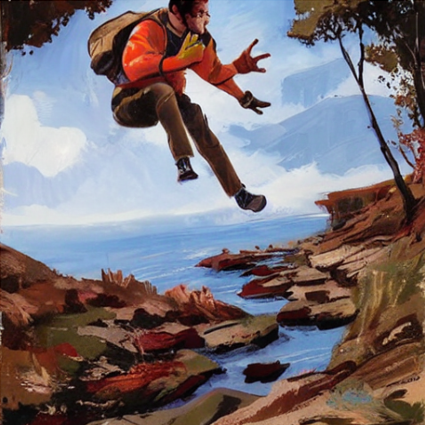 |
        :---: | :---: | :---: | :---:
        GUIDANCE | 2,6 | 3,8 | 3 |
        LORA_SCALE_UNET | 1 | 1 | 0,8 |
        LORA_SCALE_TEXT_ENCODER | 1 | 1 | 0,2 |

        Для промта *A ktn is falling from the cliff*:

        Image | 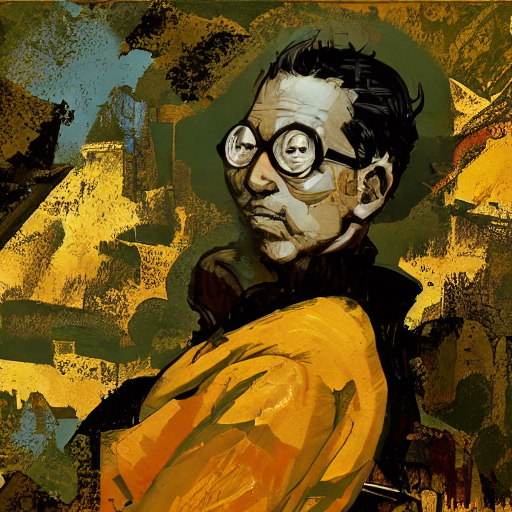 | 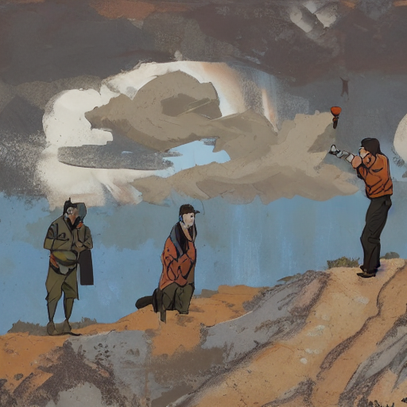 | 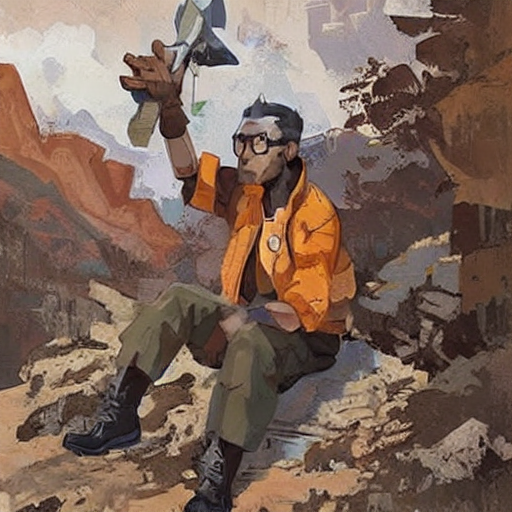 |
        :---: | :---: | :---: | :---:
        GUIDANCE | 3,2 | 3 | 3,6 |
        LORA_SCALE_UNET | 1 | 0,9 | 1 |
        LORA_SCALE_TEXT_ENCODER | 1 | 0,6 | 1 |

        Тут персонажа модель пытается отрисовать, но условие промта изобразить не получается.
   
   * Promt: *sitting in the pub*:

        Результаты для сравнения:

        Image | 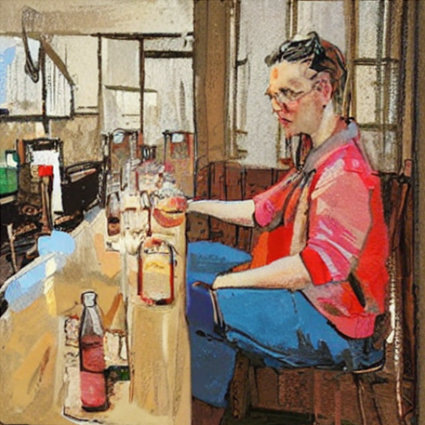 | 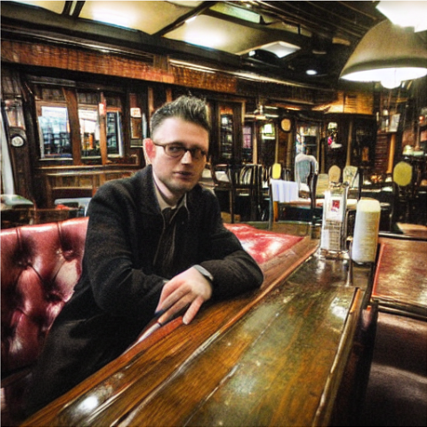 | 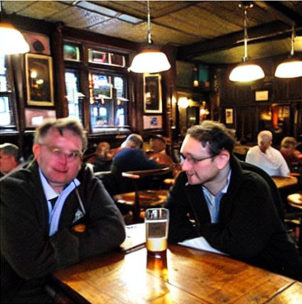 |
        :---: | :---: | :---: | :---:
        GUIDANCE | 3 | 5 | 9 |
        LORA_SCALE_UNET | 1 | 1 | 1 |
        LORA_SCALE_TEXT_ENCODER | 1 | 1 | 1 |

        Тут модель полностью теряет ориентир на оригинал и начинает слишком сильно придумывать от себя на основе только текстового запроса.

        Наиболее удачными были следующие гиперпараметры инференса при данной настройке:

        Image | 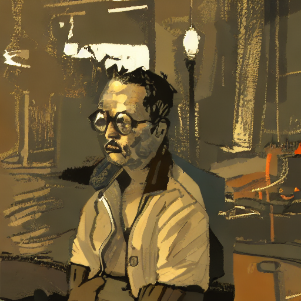 | 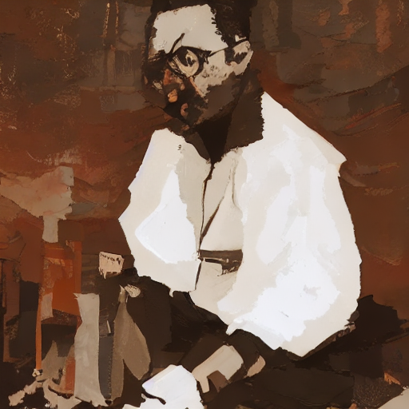 | 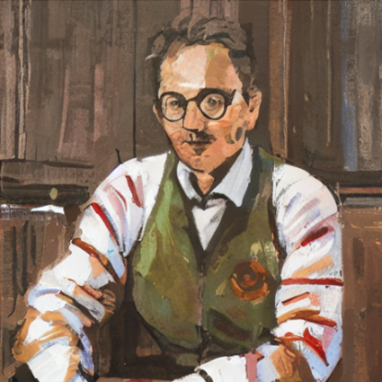 |
        :---: | :---: | :---: | :---:
        GUIDANCE | 3 | 5 | 9 |
        LORA_SCALE_UNET | 1 | 1 | 1 |
        LORA_SCALE_TEXT_ENCODER | 1 | 1 | 1 |

        Тут хотя бы прослеживаются некоторые основные черты персонажа и его стиль. Интересно отметить, что на последней фотографии модель постаралась сохранить лицо объекта при этом, изменив его внешний вид.

        Для промта *A ktn is falling from the cliff*:

        Image | 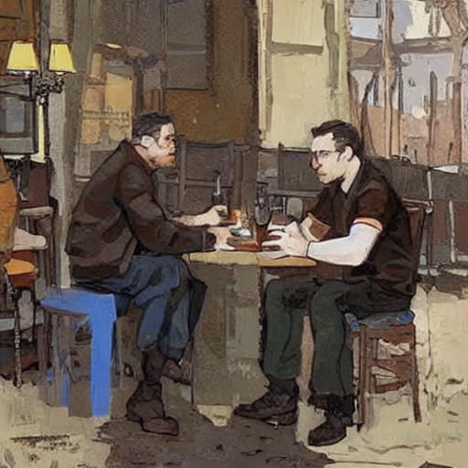 | 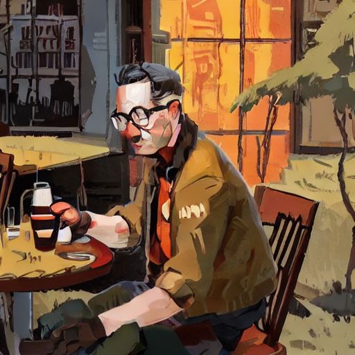 | 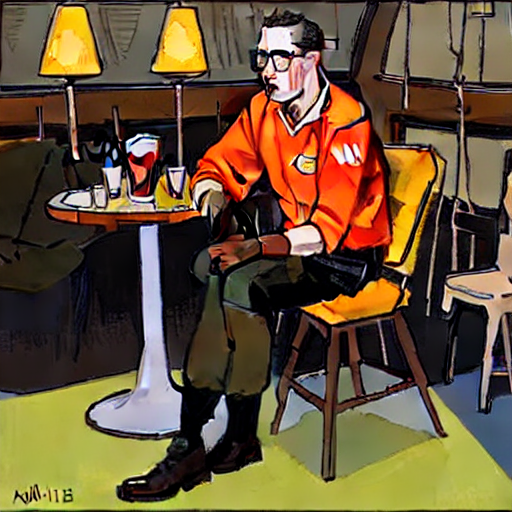 |
        :---: | :---: | :---: | :---:
        GUIDANCE | 3 | 5 | 9 |
        LORA_SCALE_UNET | 1 | 1 | 1 |
        LORA_SCALE_TEXT_ENCODER | 1 | 1 | 1 |

        Тут стоит отметить, что если раньше генерация в большей степени была на основе описания, то при чётком обозначении объекта, она стала намного лучше.

3. Попробуем немного изменить тактику генерирования картинок. Сейчас видно, что наилучший результат получается при `GUIDANCE` около 3, поэтому посмотрим на генерации при `GUIDANCE` $= 3$. И так как предыдущий эксперимент дал хуже результат, то вернем `lr_scheduler` на constant, а скорости обучения увеличим: `learning_rate` $=4e-4$ и `learning_rate_text` $5e-5$.

    Ниже на рисунках по столбцам  - это значения `learning_rate_text`, по строкам - `learning_rate` (все изображения по-отдельности можно найти в соответсвующих папках):

    * Promt: *smile face*:
        
        <!--  G = 2-->
        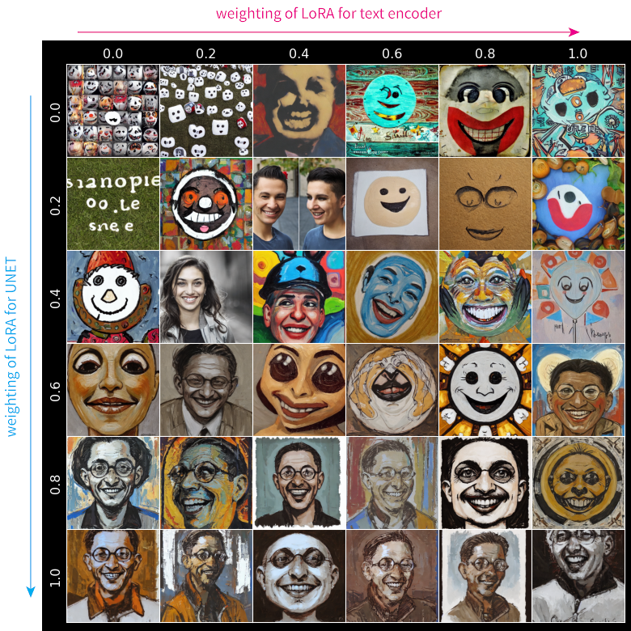
        <!--  G = 4.5-->

    * Promt: *A ktn is smiling*:

        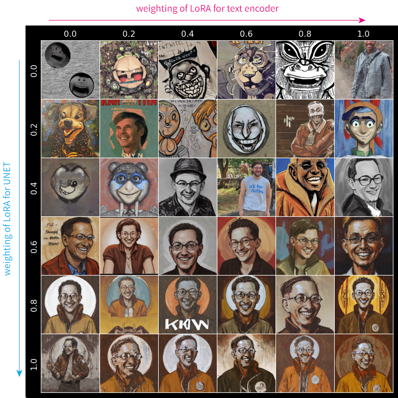

    Намного лучше получился результат (что в принципе очеыидно).

    * Promt: *falling from the cliff*:
        
        <!--  G = 2-->
        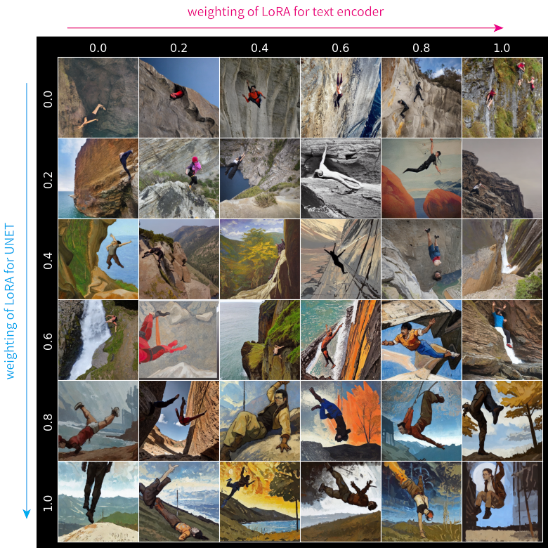
        <!--  G = 4.5-->

    * Promt: *A ktn is falling from the cliff*:

        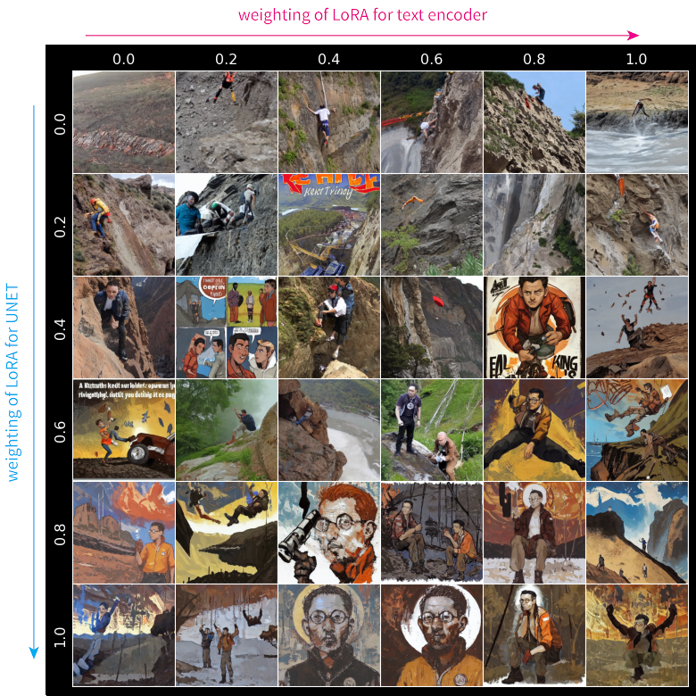

    * Promt: *sitting in the pub*:
        
        <!--  G = 2-->
        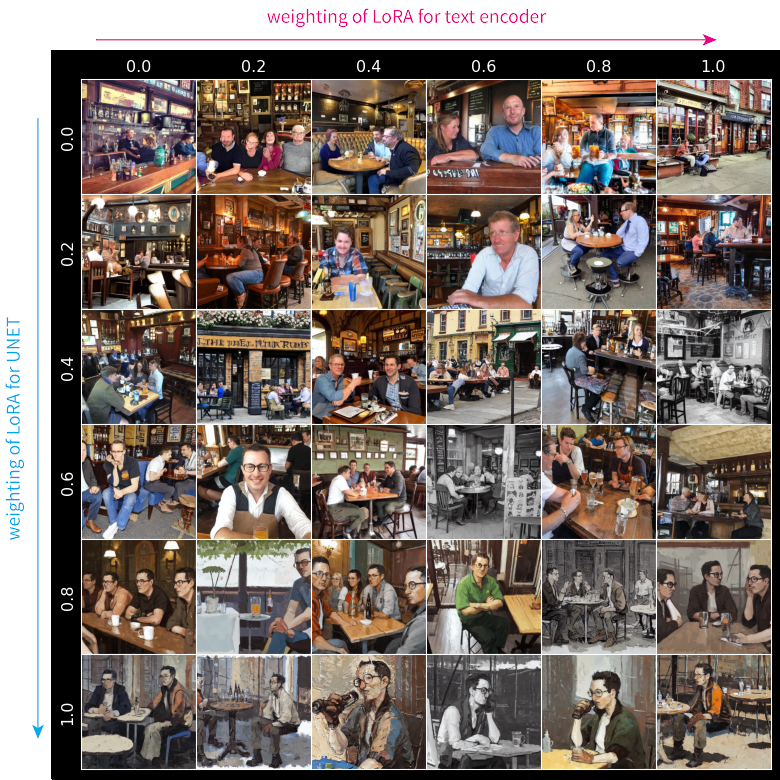
        <!--  G = 4.5-->

    * Promt: *A ktn is sitting in the pub*:

        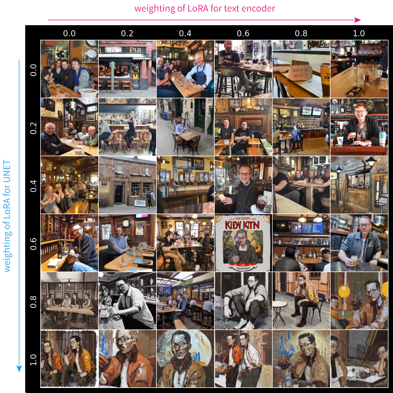

    Для всех промтов при данной настройке гиперпараметров обучения, видно, что наиболее схожий (с описанием и оригиналом) результат получается при `learning_rate` больше $0.8$ и при любом `learning_rate_text` в этих условиях. Причем при конкретном указании объекта в промте результат стал в разы лучше.

4. Посмотрим на сколько изменится качество, если увеличить количество шагов. Для этого сделаем `steps` $= 5000$, `LEARNING_RATE` $= 1e-4$, `LEARNING_RATE_TEXT_ENCODER` = $1e-5$, все остальные парметры оставим такими же как и в 3 эксперименте.
    * Promt: *smile face*:

        <!--  G = 2-->
        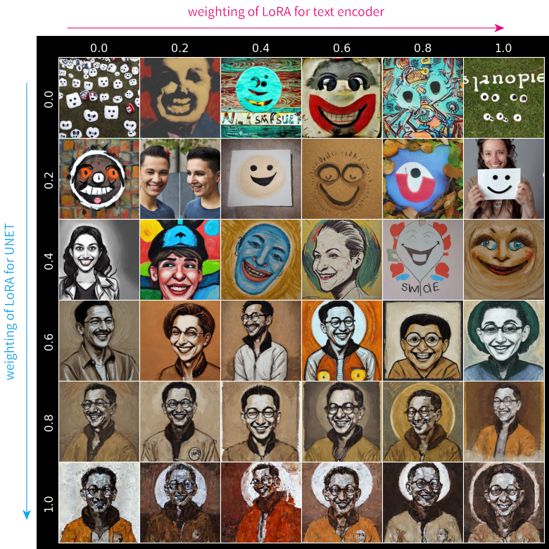
        <!--  G = 4.5-->

        Интересным показалось, что при определённых гиперпараметрах инференса, модель пыталась сгенерировать (и довольно удачно) женскую версию исходного персонажа.
    
    * Promt: *A ktn is smiling*:

        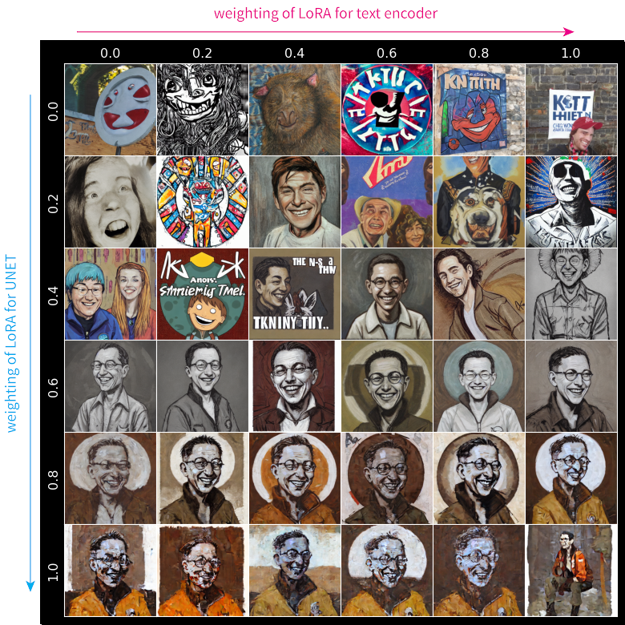

    * Promt: *falling from the cliff*:
        
        <!--  G = 2-->
        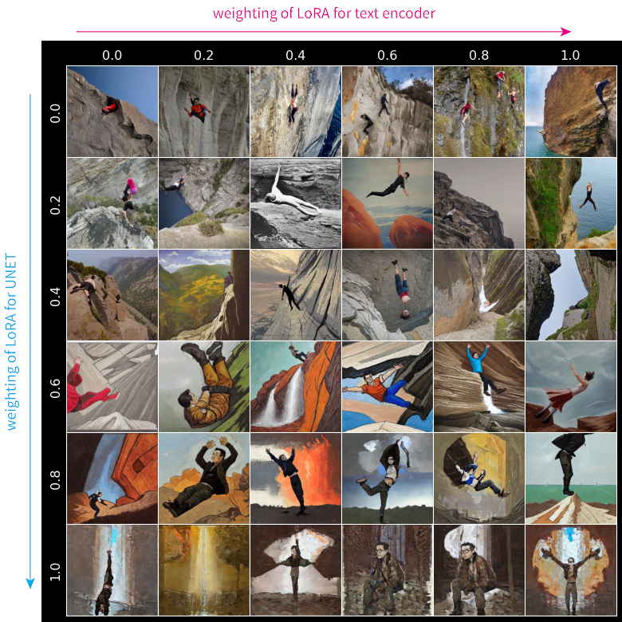
        <!--  G = 4.5-->
    
    * Promt: *A ktn is falling from the cliff*:

        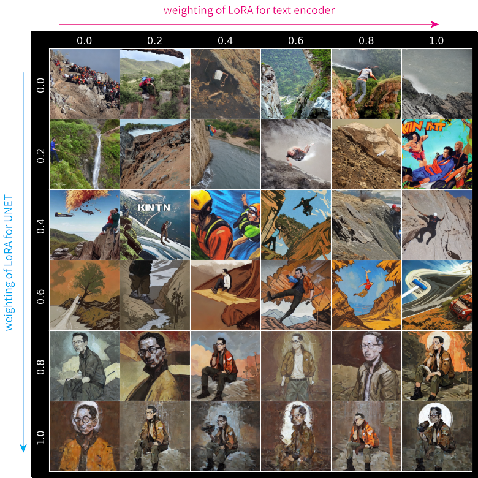

        Модель хоть и отрисовывает персонажа, но изобразить его в падающем состоянии всё равно не получается.

    * Promt: *sitting in the pub*:
        
        <!--  G = 2-->
        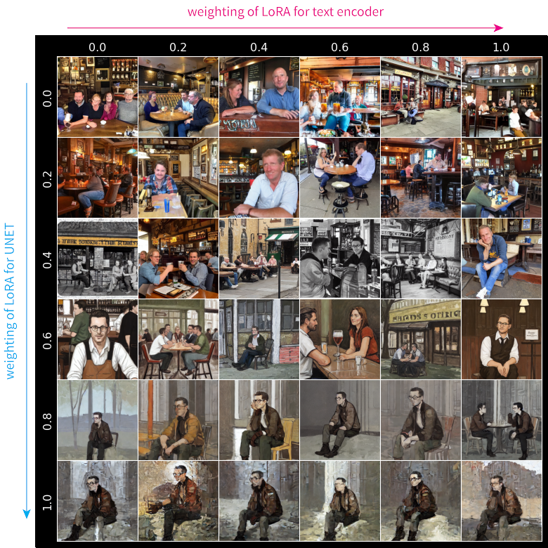
        <!--  G = 4.5-->

    * Promt: *A ktn is sitting in the pub*:

        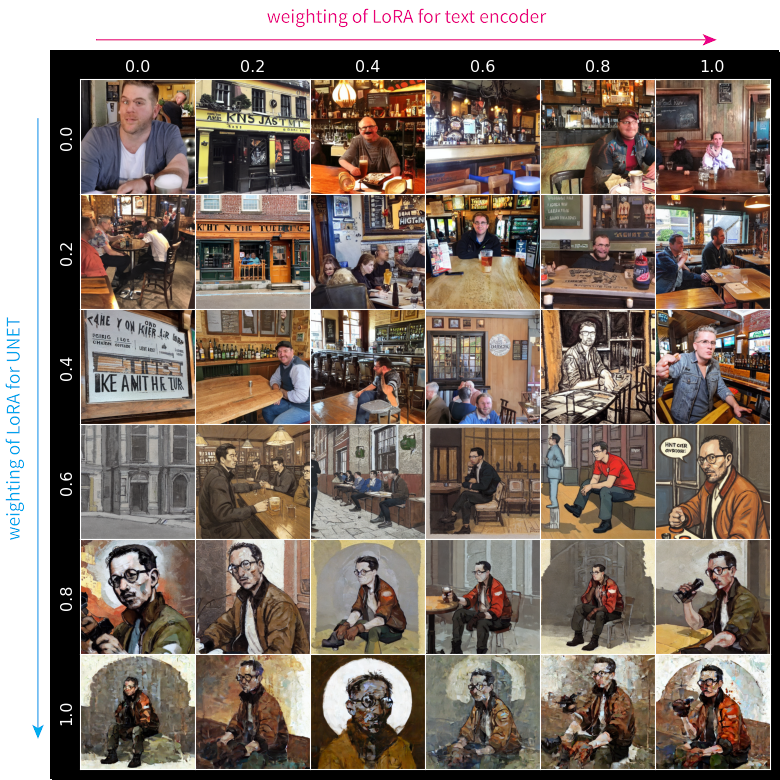

    По сравнению с предыдущими результатами, видно что количество шагов положительно влияет на сходсво полученных (на основе описания) изображений с оригиналом. Начиная уже с `learning_rate` равным 0.6 (а при генирации улыбки даже и с 0.4) изображения хорошо описывают заданный промт в стилистике оригинала. Но, стоит отментиь, что в большинстве изображений остались артефакты, например, такие как неправильная анатомия.

Модели все ещё довольно сложно изобразить падающего персонажа (из всех генераций удачними были только несколько). Она очень часто вместо этого "ссылается" на персонажа в сидячей позе, который был в тренировке. 

Как показывает данный эксперимент, нужно очень аккуратно подбирать не только сами фотографии при обучении, но и гиперпараметры (особенно при инференсе). Увеличение количества шагов положительно сказывается на результате.

## Схожие исследования.

Помимо настройки весов самой LoRA модели можно дообучать и веса модели U-Net. А также менять более фундаментальные параметры, например, `--lora_rank`. Но для получения репрезентативных результатов нужен довольно большой запас вычислительных ресурсов, поэтому ниже приведу только ссылки.

1. [What does the R in LoRA mean? And why tweaking it is cool!](https://github.com/cloneofsimo/lora/discussions/37)
2. [Low-rank Adaptation for Fast Text-to-Image Diffusion Fine-tuning](https://github.com/cloneofsimo/lora#tips-and-discussions)

В первой ссылке, кроме влияния learning rate параметров двух сетей, проводилось сравнение Dreambooth и LoRA подходов при различных значениях ранга разложения в модели LoRA, а также рассчет количества обучаемых параметров. Оказалось, что даже при `lora_rank` $= 1$ результат можно считать удовлетворительным. Во второй же ссылке даны общие рекомендации по настройке гиперпараметров. 

Большую свободу действий дает ноутбук представленный в данном репозитории by  [@brian6091](https://github.com/brian6091/Dreambooth): 
. Он позволяет настраивать гиперпараметры обоих сетей: U-Net и LoRA, а также использовать один из подходов: Dreambooth или LoRA, также в этом ноутбуке добавлена автоматическая аугоментация исходных изображений для повышения точности генерируемого результата. 

# References
1. DreamBooth: 

